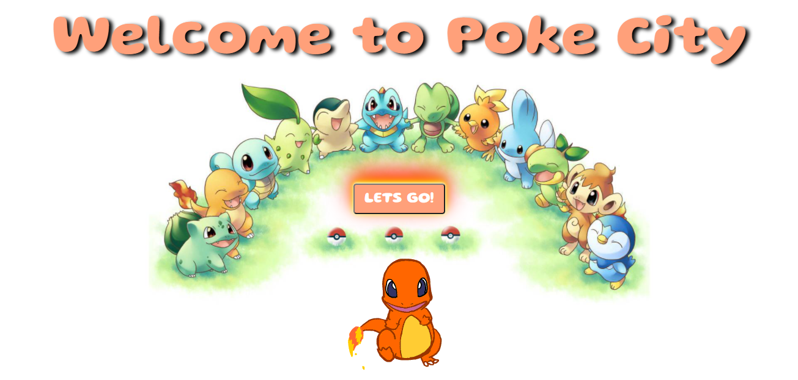
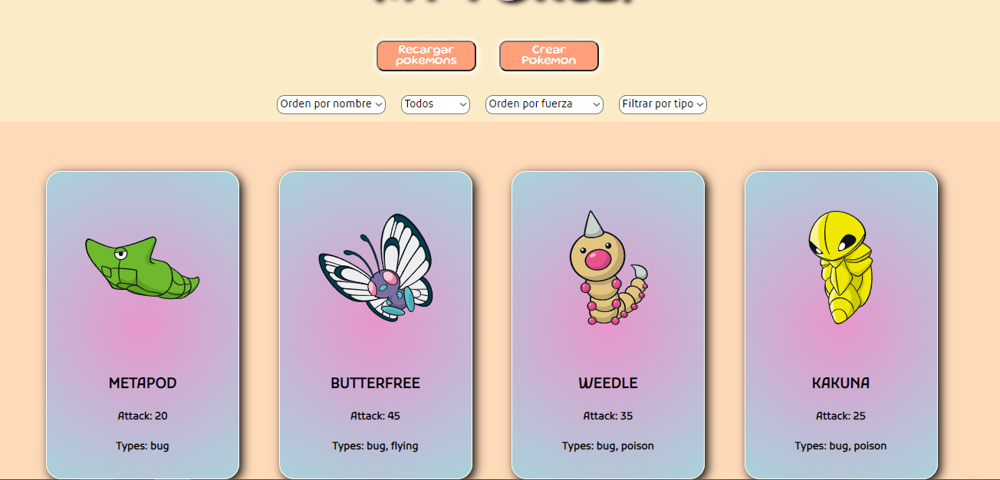
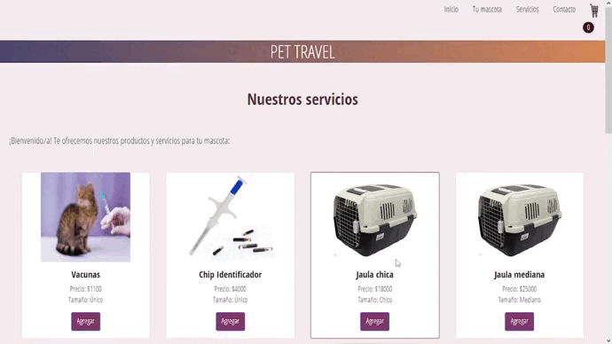

<h2>Hi there, I'm Danae!:paw_prints::paw_prints: </h2>
 <h2>A passionate Full-Stack Developer from Argentina </h2>

<!-- ## My skills:  -->

<!-- 

 -->

<h2 align="left">Connect with me:</h2>

  
   danaemeneses5@gmail.com

<h2 align="left">⭐ Languages and Tools:</h2>

            

<h2 align="left">📌My projects</h2>
<h3> PokeApp </h3>

En este proyecto individual, utilizando datos extraídos de una API (pokeapi.co), hice una SPA utilizando las siguientes tecnologías: 

Frontend: 

<li> Javascript </li>
<li> React </li>
<li> Redux en el manejo de estados </li>
<li> Styled components para los estilos </li>
 

Backend

<li> NodeJS </li>
<li> ExpressJS </li>
<li> Sequelize </li>
<li> PostgreSQL </li>
 

Entre sus funciones están:
 Busqueda exacta por nombre, filtrar por tipos, filtrar por origen, ordenar alfabéticamente, ordenar por fuerza creciente y decreciente, ver detalles de cada pokemon y crear tu propio pokemon. 

 

 
<h3> Pet Travel </h3>

Este proyecto fue mi trabajo final en el curso de Javascript en CoderHouse

Trabajé sobre el manejo del DOM, eventos, jQuery, AJAX. Realicé un e-commerce llamando a la API de mercado pago para finalizar la compra. 

 

